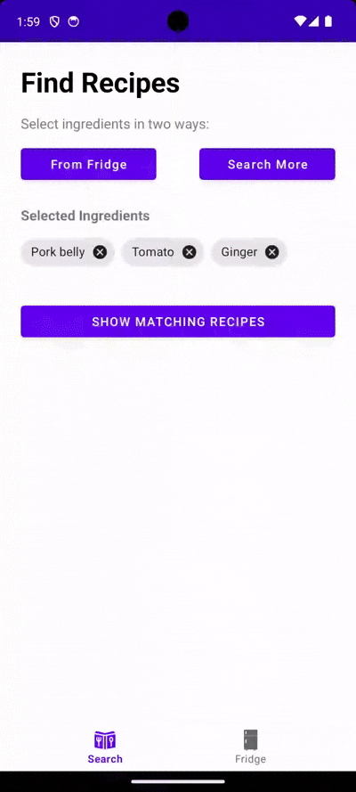

# 🧊 From Fridge – Android Recipe Finder App

**From Fridge** is an Android application that helps users discover Chinese recipes based on ingredients they already have at home. It aims to reduce food waste and inspire creativity in everyday cooking by making it easy to manage your virtual fridge and match ingredients to real recipes.

---
<h3>🎥 Demo</h3>
<p >
  
</p>


## 🔗 Backend API

This app works with a custom Java Spring Boot REST API backend available at:  
👉 [https://github.com/QWang00/from-fridge-api](https://github.com/QWang00/from-fridge-api)

---

## 📲 Features

- 🧊 **Fridge Management** – Add, remove, and clear ingredients in your fridge
- 🧠 **Recipe Matching** – Discover recipes based on up to 5 selected ingredients
- 🔍 **Flexible Ingredient Search** – Select ingredients from fridge or search by keyword
- 📋 **Detailed Recipe View** – View recipe image, servings, cook time, difficulty, ingredients and steps
- ✅ **Smart Ingredient Highlighting** – Fridge-owned ingredients are visually marked in green

---

## 🧪 Tech Stack

- **Frontend**: Android (Java), MVVM architecture, DataBinding, RecyclerView
- **Networking**: Retrofit2
- **UI/UX**: Material Components, ChipGroup, Dialogs
- **Image Loading**: Glide
- **Backend**: Spring Boot API – [backend repo](https://github.com/QWang00/from-fridge-api)

---

## 🚀 Getting Started

### 1. Clone this repository

```bash
git clone https://github.com/QWang/from-fridge-android.git
````

### 2. Open in Android Studio

* Open the project in Android Studio.
* Ensure you have a working emulator or physical device.

### 3. Configure Backend URL

In `RetrofitInstance.java`, update the `BASE_URL` to match your backend address (local or deployed):

```java
private static final String BASE_URL = "http://10.0.2.2:8080/api/v1/from-fridge/";
```

> `10.0.2.2` is used to access localhost from Android emulator.

### 4. Run the App

---

## ✅ Roadmap

* [x] Match recipes by fridge ingredients
* [x] Display detailed recipe view
* [x] Highlight owned ingredients
* [ ] Add favorites/bookmarks
* [ ] Add login/authentication
* [ ] Support internationalisation (i18n)

---

## 🤝 Acknowledgements

This project was created as part of a university computing project, with a focus on solving real-life cooking inspiration problems using mobile technology.


